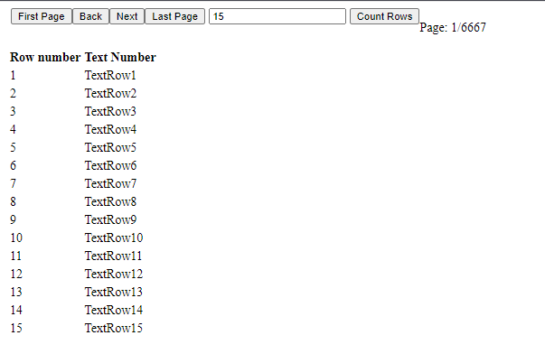

# Задача

Создать базу данных, в ней создать таблицу с несколькими столбцами и добавить в неё 100 000 произвольных записей.
Создать одностраничный сайт и вывести на страницу информацию из таблицы. Реализовать возможность постраничного деления информации, навигации по страницам (возможность перехода к первой, последней, следующей и предыдущей странице), вывести количество записей таблицы.
Реализовать возможность выбора количества записей, которых можно загрузить на страницу. Время загрузки страницы должно быть меньше одной секунды.
Можно ограничиться простейшим дизайном страницы.
Для выполнения задания необходимо использовать ASP.NET (C#), MVC 5 и MS SQL Server.

# Решение:

Собственно решение задачи с 100000 строками производилось при помощи обычного цикла в MS SQL в скрипте:

declare @index int
set @index=0
 while @index<100000
 begin
 insert into dbo.Items (name, price) values(Concat('textRow',CAST(@index as varchar(128))), @index)
 set @index=@index+1
 end
 
А сама программа выглядит так: 

